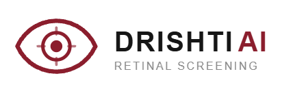

<p align="center">
  
</p>

<h1 align="center">Drishti AI</h1>
<p align="center"><b>AI-assisted retinal image screening prototype for diabetic retinopathy</b></p>

<p align="center">
  
  
  
  
  
  
  
  
</p>

<p align="center">
  <a href="https://drishti,sayonedu.in/">Live Demo (Vercel)</a> ·
  <a href="https://drishti,sayonedu.i/screening">Prototype Demo</a> ·
  <a href="#getting-started">Getting Started</a> ·
  <a href="#medical-disclaimer">Medical Disclaimer</a>
</p>

---

> **⚠️ Research prototype — not a medical device.** Drishti AI is an AI-assisted screening aid, not a diagnostic system. See [Medical Disclaimer](#medical-disclaimer).

## Overview

Drishti AI is a research prototype that explores how AI-assisted retinal image analysis could support diabetic retinopathy (DR) screening — particularly in settings where specialist ophthalmology access is limited. It was built as part of Smart India Hackathon (SIH) work and the author's broader research interest in AI-assisted healthcare.

The application takes a fundus (retinal) image, runs it through a real, already-trained EfficientNet-B0 classifier hosted on a private Hugging Face Space, and presents the predicted DR severity class, per-class probabilities, and a Grad-CAM visual explanation — all framed for **human clinician review**, not autonomous diagnosis.

## Problem

Diabetic retinopathy is a leading cause of preventable blindness, and early screening is effective but bottlenecked by the availability of trained specialists to review retinal images, especially in primary/community healthcare settings.

## Solution

Drishti AI proposes a screening-support workflow: capture a retinal image → run it through an AI classifier → surface the prediction, confidence, and an explainability heatmap → route it to a clinician for review and referral decisions. The current repository implements the web application and inference-calling layer of that workflow; the model itself is trained and served separately.

## Key Features

- Retinal image upload with client-side type/size validation
- Real, non-ML image-quality assessment (resolution, illumination, contrast/focus proxy) computed via `sharp`
- AI-based 5-class diabetic retinopathy classification via a real EfficientNet-B0 model
- Per-class probability breakdown and confidence score
- Grad-CAM visual explainability, generated by the model itself
- Clinician review step built into the UI workflow
- Server-side-only Hugging Face authentication — the browser never talks to Hugging Face directly

## System Architecture

```mermaid
flowchart LR
  U[User] -->|upload image| FE[Next.js App Router UI\n/app/screening]
  FE -->|multipart/form-data POST| API[/api/predict Route Handler/]
  API --> Q[Image quality heuristics\nlib/image-quality.ts (sharp)]
  API --> H[lib/hf-inference.ts\n@gradio/client + HF_TOKEN]
  H -->|/predict| HF[Private Hugging Face Space\nsayon-mitra024/drishti-ai-inference\nEfficientNet-B0]
  HF -->|prediction JSON + Grad-CAM file| H
  H -->|fetch w/ Bearer token, re-encode as data: URL| API
  API --> R[Recommendation mapping\nlib/recommendations.ts]
  API -->|JSON| FE
  FE --> Results[Results / Grad-CAM / Clinician Review UI]
```

This repository does **not** train, retrain, host, or modify the model. It calls the Space's `/predict` endpoint server-side via `@gradio/client` and adapts its outputs into this app's response contract.

## AI Model

| Field | Value |
|---|---|
| Architecture | EfficientNet-B0 (torchvision) |
| Task | Diabetic retinopathy classification, 5-class |
| Classes (exact index order) | `0: No DR`, `1: Mild`, `2: Moderate`, `3: Severe`, `4: Proliferative DR` |
| Input size | 224 × 224 |
| Preprocessing | Resize → `ToTensor` → ImageNet normalization (mean `[0.485, 0.456, 0.406]`, std `[0.229, 0.224, 0.225]`) — performed entirely inside the Hugging Face Space |
| Serving | Private Hugging Face Space (Gradio), `/predict` endpoint, one image input, two outputs (prediction JSON + Grad-CAM image) |
| Explainability | Grad-CAM, generated by the model and returned as an image by the Space |

**Training data and evaluation metrics for the deployed checkpoint are not documented in this repository** and are not independently re-derived here — they live with the model owner on the Hugging Face Space. This app only validates the *shape* of what comes back (5 finite, non-negative probabilities summing to ~1) before passing it through unmodified; it never fabricates or adjusts confidence values.

### Research background (separate from this deployment)

Earlier experimentation for this project was carried out on the **APTOS 2019 Blindness Detection** dataset (3,662 images, 5-fold cross-validation, EfficientNet-B0, image size 224×224, batch size 16, 5 epochs). These are experimental results from that research phase — **not** a validated benchmark of the specific checkpoint currently served by the Hugging Face Space, and not clinical performance figures:

| Setup | Accuracy | Macro F1 | QWK |
|---|---|---|---|
| Baseline | 0.7993 ± 0.0144 | 0.6563 ± 0.0134 | 0.8711 ± 0.0224 |
| FOV crop | 0.7952 ± 0.0150 | 0.6473 ± 0.0169 | 0.8753 ± 0.0145 |
| FOV + CLAHE | 0.7958 ± 0.0113 | 0.6566 ± 0.0152 | 0.8788 ± 0.0132 |

A single evaluation run also reported: Accuracy 0.7954, Macro F1 0.6526, QWK 0.8659, Referable-DR F1 0.9112, ECE 0.0501 — along with documented high-confidence misclassifications (e.g. a `Mild → No DR` error at ~99.94% confidence), underscoring why this remains a screening-support aid requiring clinician review rather than an autonomous diagnostic tool.

## Explainability with Grad-CAM

Grad-CAM is generated by the model inside the Hugging Face Space and returned as its second `/predict` output. `lib/hf-inference.ts` fetches that file server-side (with the same `HF_TOKEN`) and re-encodes it as a `data:` URL, rendered by `components/gradcam-viewer.tsx` and labeled `type: "trained_model"`.

Grad-CAM provides a visual indication of image regions associated with the model's prediction — it is an interpretability aid, not a clinical explanation, and does not by itself prove why a diagnosis is correct. If the Grad-CAM fetch or the Space's output is malformed, explainability degrades to `available: false` without affecting the prediction response itself.

## Web Application

- **Next.js 16** (App Router), **React 19**, **TypeScript**, **Tailwind CSS v4**
- `app/page.tsx` — overview/home page
- `app/screening/page.tsx` + `components/screening-workspace.tsx` — the 5-stage client workflow: **Capture → Quality Check → AI Analyze → Results → Clinician Review**, driven by local React state
- Presentational components split by concern: stepper, upload dropzone, analyzing loader, probability bars, Grad-CAM viewer, quality metrics panel, clinician review
- Design tokens (colors, typography, radii) ported from the project's Stitch design system into `app/globals.css`

The existing UI/visual system is the source of truth for this documentation and has not been redesigned as part of this README update.

## Inference Architecture

Single Next.js Route Handler, Node.js runtime (`app/api/predict/route.ts`):

1. Parse `multipart/form-data`, extract the image
2. Validate MIME type (`image/jpeg`, `image/jpg`, `image/png`) and size (≤ 15 MB)
3. `assessImageQuality()` — real `sharp` metadata + pixel statistics (resolution, illumination, contrast/focus proxy)
4. `runHFInference()` — connects to the Hugging Face Space via `@gradio/client` with a cached, server-only connection:
   - Validates the returned prediction JSON against the exact 5-class contract
   - Fetches the Grad-CAM output with a `Bearer` token and re-encodes it as a `data:` URL server-side
   - Throws a typed `HFInferenceError` (`config` / `auth` / `unavailable` / `timeout` / `malformed`), mapped to a clean HTTP status for the client
5. Static recommendation lookup (`lib/recommendations.ts`) — referral-support text per class, no prescriptions or dosages
6. Response re-validated (5 classes, finite values, sums to ~1) before returning

**Local-dev-only fallback:** `lib/mock-inference.ts`, enabled via `MOCK_MODE=true`, is a deterministic, seeded heuristic — not a trained classifier — used only for local UI development without `HF_TOKEN` configured. Every such response is tagged `model.mock: true` and must never be enabled in a deployment presented as using the real model.

## API

| Route | Purpose |
|---|---|
| `POST /api/predict` | Accepts an uploaded image, returns quality metrics, the model's prediction (`predicted_class`, `predicted_class_index`, `confidence`, `class_probabilities`), a Grad-CAM image, and referral recommendations |
| `GET /api/health` | Checks backend configuration (currently verifies `HF_TOKEN` is present) |

Example (illustrative) response shape:

```json
{
  "predicted_class": "No DR",
  "predicted_class_index": 0,
  "confidence": 0.9985,
  "class_probabilities": {
    "No DR": 0.9985,
    "Mild": 0.00094,
    "Moderate": 0.00034,
    "Severe": 0.000075,
    "Proliferative DR": 0.000098
  },
  "model": { "mock": false, "architecture": "EfficientNet-B0" }
}
```

This is an example only — actual probabilities vary per image and are never guaranteed values.

## Technology Stack

| Layer | Technology |
|---|---|
| Frontend | Next.js 16.3.6, React 19.2.0, TypeScript ^5.7, Tailwind CSS v4 |
| Image quality | `sharp` ^0.34.2 |
| HF connectivity | `@gradio/client` ^2.7.0 |
| Model serving | Hugging Face Spaces, Gradio |
| Model | PyTorch / torchvision, EfficientNet-B0 |
| Package manager | pnpm 10.34.3 |
| Frontend hosting | Vercel |

## Project Structure

```
drishti-ai/
├── app/
│   ├── page.tsx                     # Home / overview page
│   ├── globals.css                  # Design tokens (Tailwind v4 @theme)
│   ├── screening/
│   │   └── page.tsx                 # Screening workflow entry point
│   └── api/
│       ├── predict/route.ts         # Main inference route handler
│       └── health/                  # Backend health check
├── components/
│   ├── screening-workspace.tsx      # 5-stage screening workflow
│   ├── gradcam-viewer.tsx           # Grad-CAM display
│   └── ...                          # stepper, upload, loader, probability bars, quality panel, review UI
├── lib/
│   ├── hf-inference.ts              # Hugging Face Space integration
│   ├── image-quality.ts             # Real sharp-based quality metrics
│   ├── recommendations.ts           # Static referral-support text
│   └── mock-inference.ts            # Local-dev-only fallback (MOCK_MODE)
├── public/
│   └── logo.png                     # Drishti AI logo
├── MODEL_CARD.md
├── ARCHITECTURE.md
├── API.md
├── DEPLOYMENT.md
├── package.json
└── README.md
```

*(This reflects the paths documented in `ARCHITECTURE.md` / `MODEL_CARD.md`; consult the repository directly for the complete, current file listing.)*

## Getting Started

### Prerequisites

- Node.js (LTS)
- [pnpm](https://pnpm.io/) `10.34.3`

### Installation

```bash
git clone <repository-url>
cd drishti-ai
pnpm install
```

### Environment Variables

Create a `.env.local` file (never commit real values):

```bash
HF_TOKEN=your_token_here
MOCK_MODE=false
```

| Variable | Purpose |
|---|---|
| `HF_TOKEN` | Server-side Hugging Face authentication token used to call the private inference Space. Never exposed to the client, never committed, never used via `NEXT_PUBLIC_*`. |
| `MOCK_MODE` | When `true`, uses the deterministic local-dev fallback (`lib/mock-inference.ts`) instead of the real model. Must be `false`/unset in any deployment presented as using the real model. |

### Development

```bash
pnpm dev
```

### Production Build

```bash
pnpm build
pnpm start
```

### Lint

```bash
pnpm lint
```

## Deployment

The frontend is a standard Next.js application, deployable to **Vercel**. Inference is served independently by the private Hugging Face Space (`sayon-mitra024/drishti-ai-inference`) and the private model repository (`sayon-mitra024/drishti-ai-efficientnet-b0`) — this app does not host, train, or bundle the model.

## Security

- `HF_TOKEN` is used **server-side only** and is never included in client-side JavaScript, `NEXT_PUBLIC_*` variables, source code, screenshots, or this README.
- The browser communicates only with this app's own `/api/predict` route — never directly with Hugging Face.
- Grad-CAM images are fetched server-side and re-encoded as `data:` URLs before reaching the client, so no Hugging Face-internal path is ever exposed.

## Limitations

- Training data and evaluation metrics for the currently deployed checkpoint are not documented in this repository and have not been independently re-verified here.
- The Hugging Face Space can go idle after inactivity; the first request after idle may take noticeably longer than typical latency (the app allows up to 45s before timing out).
- No retry/circuit-breaker logic beyond a single timeout per stage — a down Space surfaces as a clean error rather than a retried background job.
- `GET /api/health` currently checks only that `HF_TOKEN` is present, not that the Space is actually reachable.
- Model confidence does not equal clinical certainty, and Grad-CAM output is not a medical explanation.
- Generalization to unseen populations, cameras, or imaging devices has not been established.
- This is a research/prototype screening aid — it requires clinical validation, regulatory evaluation, and human clinical oversight before any clinical deployment.

## Medical Disclaimer

> Drishti AI is an AI-assisted research and prototype screening system.
> It is not a medical device and does not replace a qualified
> ophthalmologist or healthcare professional.
>
> Predictions and visualizations must not be used as the sole basis
> for diagnosis, treatment, or clinical decision-making.
>
> Clinical validation, regulatory evaluation, and appropriate medical
> oversight are required before clinical deployment.

## Future Work

- Persistent clinical record storage (currently session-local only), with proper authentication and audit trail
- Browser-based camera capture (`getUserMedia`) as an alternative to file upload
- Retry/backoff handling for Hugging Face Space cold-starts, plus a deeper health check that verifies actual Space reachability (not just token presence)
- A trained image-quality classification model to replace the current heuristic-based `lib/image-quality.ts` (already structured to be swappable)
- Native Android client (Kotlin, Jetpack Compose) calling the same secure Next.js API — planned as a separate client, not part of this repository
- Broader dataset validation and clinical evaluation

## Research & Reproducibility

This project combines an applied engineering prototype (this repository) with earlier model research conducted separately on the APTOS 2019 dataset (see [Research background](#research-background-separate-from-this-deployment)). The system architecture, class labels, preprocessing, and API contract documented above allow a technically competent reader to understand the current implementation; full reproducibility of the original model training is outside the scope of this repository, since the training code and dataset access live with the model owner rather than here.

## Author

**Sayon Mitra**
B.Tech CSE Core, Chandigarh University

Areas of interest: Artificial Intelligence, Machine Learning, Computer Vision, AI-assisted healthcare, research and innovation.


- Email: `sayonmitracode@gmail.com>`

## License

This project is licensed under the **MIT License**. See [`LICENSE`](./LICENSE) for details.